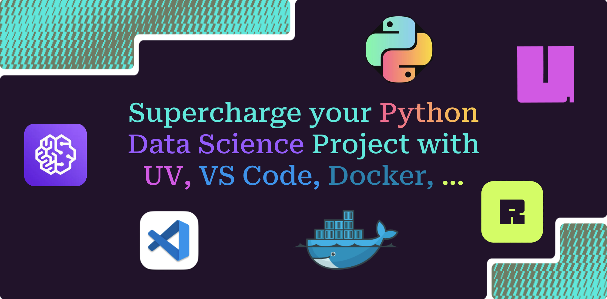

# UV Data Science Project MonoRepo Template

<!--docs-ref-index-0-start-->
<div align="center">
  
  <p><em>Image by David T. [Source: Astral]</em></p>
</div>
<!--docs-ref-index-0-end-->

<!--docs-ref-index-0.1-start-->
[](https://github.com/tiefenthaler/uv-datascience-project-template/actions/workflows/testing.yml)
[](https://github.com/tiefenthaler/uv-datascience-project-template/blob/coverage-badge/coverage.svg)
[](https://github.com/tiefenthaler/uv-datascience-project-template/actions)
[](https://github.com/tiefenthaler/uv-datascience-project-template/actions/workflows/publish-docs.yml)
[](https://github.com/tiefenthaler/uv-datascience-project-template/actions/workflows/docker.yml)
[](https://opensource.org/licenses/MIT)
<!--docs-ref-index-0.1-end-->

<!--docs-ref-index-1-start-->
> **Tutorial for a MonoRepo Project with UV for Python / Data Science**

What I mean by a monorepo:

- 2+ packages with interdependencies using the [Cargo](https://doc.rust-lang.org/cargo/reference/workspaces.html) concept by utilizing [Workspaces with UV](https://docs.astral.sh/uv/concepts/projects/workspaces/).
- The ability to lock dependencies across packages (where not needed, split into multiple workspaces). More sophisticated multi-version handling would be great but out of scope.
- The main package is defined in the `src` folder of the `root` project, while other packages are defined under the `packages` folder.
- Multiple packages with single lockfile.
- Dependencies between workspace members are editable.

This **UV Setup** supports the given scope.

> **General Tutorial Project for 1) Developing Data Science Projects in a Dev Container, and 2) Machine Learning Applications in Production**

This guide provides instructions on how to develop and productionize machine learning applications in a robust and efficient way.  
It is demonstrated how to achieve this using a modern setup of tools, like UV, Docker, Ruff, FastAPI and more (see [Overview Tools](#overview-tools) Section). The focus of this project is to give an introduction to using those tools and not on how to properly set up a machine learning application (for production). Therefore only a simple machine learning pipeline based on PyTorch/Lightning and FastAPI is used.

> **See the related [Project Documentation](https://tiefenthaler.github.io/uv-datascience-project-template/) for additional information.**
<!--docs-ref-index-1-end-->

- [UV Data Science Project MonoRepo Template](#uv-data-science-project-monorepo-template)
  - [Cargo Concept utilized by UV Workspaces](#cargo-concept-utilized-by-uv-workspaces)
    - [MonoRepo Concept](#monorepo-concept)
    - [Getting Started](#getting-started)
  - [Overview Tools](#overview-tools)
  - [Using uv to Manage the Project](#using-uv-to-manage-the-project)
    - [pyproject toml](#pyproject-toml)
  - [Custom Code in src Folder](#custom-code-in-src-folder)
    - [lit\_auto\_encoder](#lit_auto_encoder)
    - [train\_autoencoder](#train_autoencoder)
    - [FastAPI Application](#fastapi-application)
      - [app\_fastapi\_autoencoder](#app_fastapi_autoencoder)
    - [main](#main)
  - [Production Setup for the Machine Learning FastAPI App hosted in the Docker container](#production-setup-for-the-machine-learning-fastapi-app-hosted-in-the-docker-container)
    - [Dockerfile](#dockerfile)
      - [Multi Stage Dockerfile](#multi-stage-dockerfile)
    - [Docker Compose](#docker-compose)
    - [Build the docker image and run a container](#build-the-docker-image-and-run-a-container)
    - [Test the endpoint with curl](#test-the-endpoint-with-curl)
  - [Development in Dev Container](#development-in-dev-container)
  - [Conclusion](#conclusion)

<!--docs-ref-index-2-start-->
## Cargo Concept utilized by UV Workspaces

See to UV documentation for [Using Workspaces](https://docs.astral.sh/uv/concepts/projects/workspaces/) and [Getting started with Workspaces](https://docs.astral.sh/uv/concepts/projects/workspaces/#getting-started).

### MonoRepo Concept

Inspired by the Cargo concept of the same name, a workspace is "a collection of one or more packages, called workspace members, that are managed together."

Workspaces organize large codebases by splitting them into multiple packages with common dependencies. Think: a FastAPI-based web application, alongside a series of libraries that are versioned and maintained as separate Python packages, all in the same Git repository.

In a workspace, each package defines its own `pyproject.toml`, but the workspace shares a single lockfile, ensuring that the workspace operates with a consistent set of dependencies.

As such, `uv lock` operates on the entire workspace at once, while `uv run` and `uv sync` operate on the workspace root by default, though both accept a `--package` argument, allowing you to run a command in a particular workspace member from any workspace directory.

```txt
.
├── pyproject.toml
├── uv.lock                           # single lockfile for multiple packages.
├── ...                               # overall project setup files like LICENSE, Dockerfile, pytest.ini, ruff.toml, ... .
├── src/uv_datascience_project_monorepo_template    # is a packaged application in this case, but can also be a lib.
|   ├── __init__.py
|   ├── main.py
|   └── train_autoencoder.py
├── tests
|   └── ...
|
└── packages
    ├── lit-auto-encoder              # is a lib.
    │   ├── pyproject.toml
    │   ├── ...                       # packages specific files like "tests/".
    │   └── src/lit_auto_encoder
    │       ├── __init__.py
    │       ├── lit_auto_encoder.py
    │       └── train_autoencoder.py
    └── mylib
        ├── pyproject.toml
        ├── ...
        └── mylib
            └── __init__.py
```

```toml
[project]
name = "uv-datascience-project-monorepo-template"
version = "0.1.0"
requires-python = ">=3.12.0, <3.13.0"
dependencies = [
    "lit-auto-encoder",   # monorepo
    "fastapi[standard]>=0.115.6",
    "pydantic>=2.10.4",
    "uvicorn>=0.34.0"
]

[tool.uv.sources]   # monorepo
lit-auto-encoder = { workspace = true }

[tool.uv.workspace]   # monorepo
members = ["packages/*"]
exclude = ["packages/mylib"]

# Defines the entry point of the packaged application
[project.scripts]
hello = "uv_datascience_project_monorepo_template:main"
```

> [!NOTE]
> The given use case only has a single direct dependency ("uv-datascience-project-monorepo-template" depends on "lit-auto-encoder"). A workspace setup is not needed for this case, but still shows how to define such a setup.
> Workspaces are intended to facilitate the development of multiple interconnected packages within a single repository.
> [When (not) to use workspaces](https://docs.astral.sh/uv/concepts/projects/workspaces/#when-not-to-use-workspaces)

### Getting Started

By default, `uv run` and `uv sync` operates on the workspace root. For example, in the above example, `uv run` and `uv run --package uv-datascience-project-monorepo-template` would be equivalent, while `uv run --package lit-auto-encoder` would run the command in the `lit-auto-encoder` package.

Since a command definition `[project.scripts]` is included, the command can be run from a console (ensure your `__init__.py` is setup correctly):

```bash
uv run hello
```

> [!NOTE]
> To properly build (`.tar.gz` and `.whl`) the application with the related libraries defined under packages, use:
>
> ```bash
> uv build
> uv build --all-packages
> ```

Install packages in your root folder with:

- Install packages in root ("uv-datascience-project-monorepo-template"):

    ```bash
    uv add --group dev pytest
    ```

- Install packages for a workspace package (e.g. "lit-auto-encoder"):
  
    ```bash
    uv add --package lit-auto-encoder --group dev pytest
    ```

Sync packages in your root folder with:

```bash
uv sync --all-packages
```

## Overview Tools

The project includes the following components, for more details see [Documentation - Guides](https://tiefenthaler.github.io/uv-datascience-project-template/guides/):

| Tool                        | Description                                                                                       |
|-----------------------------|---------------------------------------------------------------------------------------------------|
| **UV**                      | A fast and efficient package manager for Python, written in Rust. It replaces tools like pip and virtualenv. |
| **Ruff**                    | An extremely fast Python linter, formatter, and code assistant, written in Rust.                  |
| **PyRight**                 | A static type checker for Python, helping to catch type-related errors early in the development process. |
| **PyTest**                  | A powerful and flexible testing framework for Python, simplifying writing and running tests.      |
| **Coverage**                | A tool for measuring code coverage of Python programs, helping to ensure that all parts of the code are tested. |
| **Pre-Commit**              | A framework for managing and maintaining multi-language pre-commit hooks to ensure code quality.  |
| **CI-GitHub**               | Continuous Integration setup using GitHub Actions to automate testing, linting, and deployment.   |
| **MkDocs**                  | A static site generator geared towards building project documentation, written in Markdown.       |
| **VSCode-DevContainer**     | A development environment setup using Docker and VS Code, providing a consistent and isolated workspace. |
| **Docker-Production**       | Docker setup for creating a lean, efficient, and secure production environment for applications.  |

## Using uv to Manage the Project

`UV` is a tool that simplifies the management of Python projects and virtual environments. It handles dependency installation, virtual environment creation, and other project configurations. In this project, `UV` is used to manage dependencies and the virtual environment inside the Docker container, ensuring a consistent and reproducible setup.

See [Guides - UV](https://tiefenthaler.github.io/uv-datascience-project-template/guides/uv/) for a comprehensive guide.

### pyproject toml

The `pyproject.toml` file includes the following sections:

1. Project metadata (name, version, description, etc.).
2. Dependencies required for the project.
3. Dependency groups for development and documentation.
4. Configuration for tools and packaging.

## Custom Code in src Folder

See [Source Code API Reference](https://tiefenthaler.github.io/uv-datascience-project-template/api/fastapi_app/) for a comprehensive documentation.

The `src` folder and the `packages/lit-auto-encoder/src` folder contains the custom code for the machine learning project. The main components include:

### lit_auto_encoder

This file defines the `LitAutoEncoder` class, which is a LightningModule an autoencoder using PyTorch Lightning. The `LitAutoEncoder` class includes:

1. An `__init__` method to initialize the encoder and decoder.
2. A `training_step` method to define the training loop.
3. A `configure_optimizers` method to set up the optimizer.

### train_autoencoder

This file defines the training function `train_litautoencoder` to initialize and train the model on the MNIST dataset using PyTorch Lightning.

### FastAPI Application

The FastAPI application is defined in the `app_fastapi_autoencoder.py` file. It includes the following endpoints:

1. `GET /`: Root endpoint that provides a welcome message and instructions.
2. `POST /train`: Endpoint to train the autoencoder model.
3. `POST /embed`: Endpoint to embed fake images using the trained autoencoder.

#### app_fastapi_autoencoder

See [Source Code API Reference](https://tiefenthaler.github.io/uv-datascience-project-template/api/fastapi_app/) for a comprehensive documentation.

This file defines the FastAPI application and the endpoints. It includes:

1. Importing necessary libraries and modules.
2. Defining global variables for the encoder, decoder, and model training status.
3. A `NumberFakeImages` class for input validation.
4. A `train_litautoencoder` function to initialize and train the autoencoder.
5. A `read_root` function to handle the root endpoint.
6. A `train_model` function to handle the model training endpoint.
7. An `embed` function to handle the embedding endpoint.
8. The application entry point to run the FastAPI application.

### main

This file defines the uvicorn server to run the FastAPI AutoEncoder application and the endpoints. It includes:

1. Importing necessary libraries and modules, including the source code of the project.
2. The application entry point to run the FastAPI application.

```python
# filepath: src/uv_datascience_project_monorepo_template/main.py

def main() -> None:
    """Run the FastAPI application."""
    uvicorn.run(app=app, host="0.0.0.0", port=8000)

# Application entry point
if __name__ == "__main__":
    main()
```

## Production Setup for the Machine Learning FastAPI App hosted in the Docker container

See [Docker Production Setup](https://tiefenthaler.github.io/uv-datascience-project-template/guides/docker_prod/) for a comprehensive guide.

### Dockerfile

The `Dockerfile` is used to build the Docker image for the project. It includes the following steps:

1. Define build-time arguments for the base container images and workspace name.
2. Use a Python image with `uv` pre-installed.
3. Set the working directory.
4. Enable bytecode compilation for faster startup.
5. Copy and install dependencies without installing the project.
6. Copy the application source code and install it.
7. Add executables and source to environment paths.
8. Set the default command to run the FastAPI application.

#### Multi Stage Dockerfile

To build the multistage image for a container optimized final image without uv use the `multistage.Dockerfile`.

### Docker Compose

The `docker-compose.yml` file is used to define and run multi-container Docker applications. It includes the following configurations:

1. Build the image from the `Dockerfile`.
2. Define the image name.
3. Host the FastAPI application on port 8000.
4. Mount the current directory to the app directory in the container.
5. Set environment variables.
6. Define the default command to start the FastAPI application.

<!--docs-ref-docker-prod-build-start-->
### Build the docker image and run a container

Build and run a specific or all services when multiple services ("app" and "app-optimized-docker") are defined in `docker-compose.yml`. Note that in the give example both services us the same port and only one service at a time should be used.

  ```bash
  docker-compose up --build
  ```

  or to build a single service only "app" respectively "app-optimized-docker".

  ```bash
  docker-compose up --build app
  ```

  ```bash
  docker-compose up --build app-optimized-docker
  ```

### Test the endpoint with curl

- Welcome root endpoint

    ```bash
    curl -X GET http://0.0.0.0:8000/
    ```

- Get docs of the request options of the FastAPI app:

    ```bash
    curl -X GET http://0.0.0.0:8000/docs
    ```

- Test the endpoint with curl by training the model first, followed by requesting predictions for n fake images

    ```bash
    curl -X POST http://0.0.0.0:8000/train \
    curl -X POST http://0.0.0.0:8000/embed -H "Content-Type: application/json" -d '{"n_fake_images": 4}'
    ```
<!--docs-ref-docker-prod-build-end-->

## Development in Dev Container

See [VSCode Dev-Container (Docker) Setup for Data Science Projects using UV](https://tiefenthaler.github.io/uv-datascience-project-template/guides/docker_vscode_devcontainer/) for a comprehensive guide.

- Run the server: `uv run /workspace/main.py`
- Test the standard endpoints with curl:
    - Get docs of the request options of the FastAPI app

        ```bash
        curl -X GET http://localhost:8000/docs
        ```

    - Welcome root request of the FastAPI app, providing an app description

        ```bash
        curl -X GET http://localhost:8000/
        ```

    - Test the machine learning endpoints with curl:

        ```bash
        curl -X POST http://localhost:8000/train \
        curl -X POST http://localhost:8000/embed -H "Content-Type: application/json" -d '{"n_fake_images": 1}'
        ```

## Conclusion

This repository provides a comprehensive overview of setting up and running the machine learning FastAPI project using Docker and `uv`. Follow the instructions to build and run the application in both development and production environments. The project demonstrates how to develop and productionize machine learning applications using modern tools and best practices.

Additionally, ensure to review the provided guides and documentation for detailed instructions on various setups and configurations necessary for optimal project performance.
<!--docs-ref-index-2-end-->
